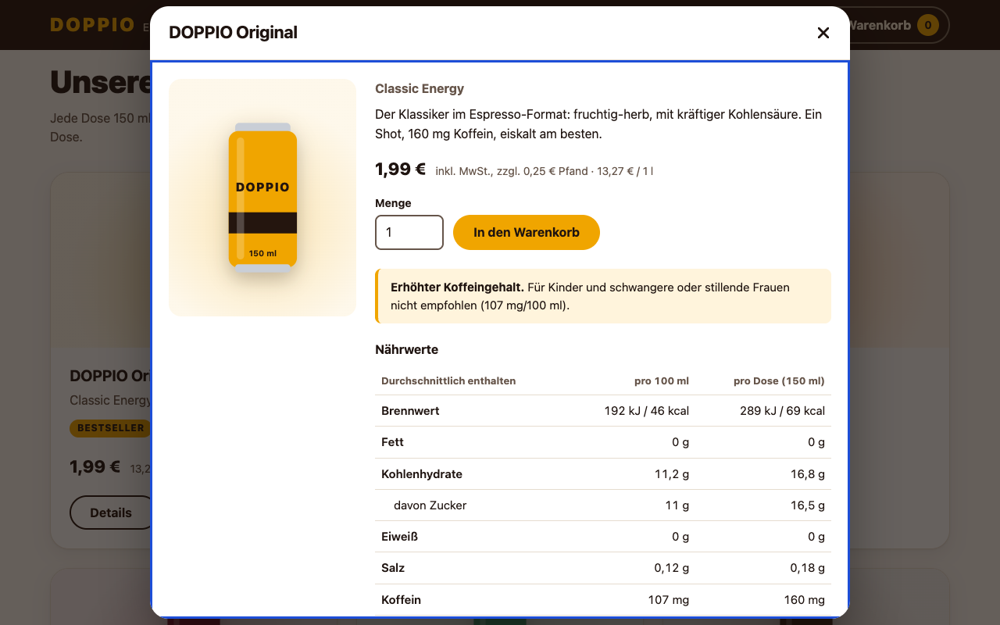
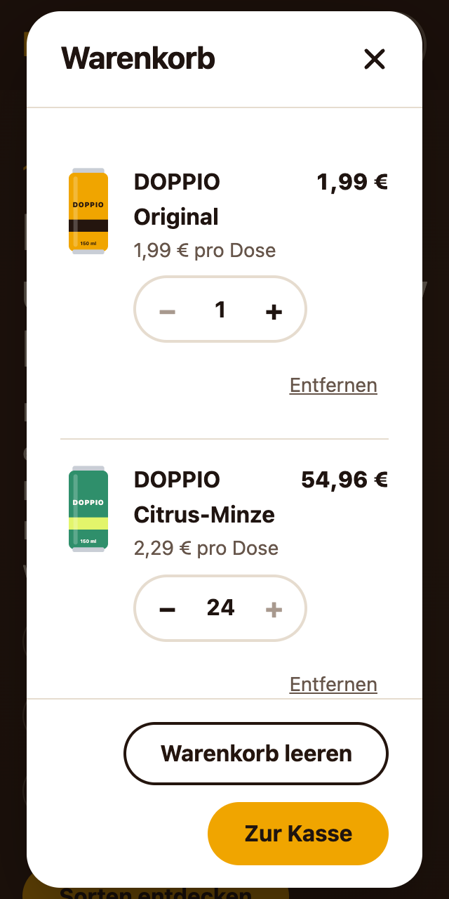
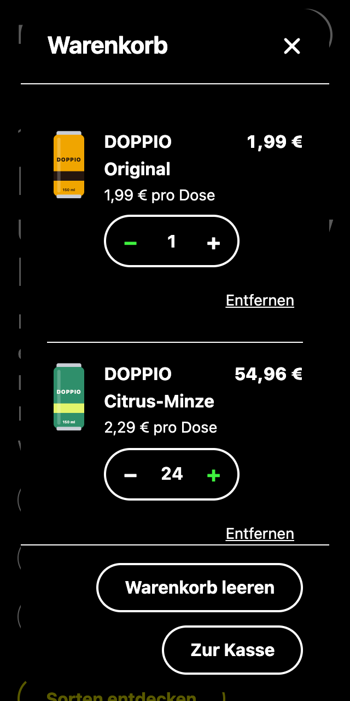

# Prüfprotokoll Barrierefreiheit (Issue #12)

**Stufe „Fortgeschritten“ laut Arbeitsblatt:** Accessibility-QA und Lighthouse ≥ 90.\
**Prüfgegenstand:** der komplette Shop nach #1–#4, #10 und #11 (Liste, Detailmodal, Warenkorb).\
**Werkzeuge:** Chrome (headless) über Puppeteer, axe-core 4.14, Lighthouse 13.5, Accessibility-Tree von Chrome.\
**Prüfungen zum Nachvollziehen:** [`tests/issue-12-barrierefreiheit.test.mjs`](../tests/issue-12-barrierefreiheit.test.mjs) (`npm test`).

## 1 Ausgangslage

Nach jedem Issue liefen axe-core (in allen Zuständen, Desktop und mobil) und Lighthouse automatisch mit, siehe [`docs/screenshots/issue-<nr>/`](screenshots/).
Vor diesem Issue war alles grün: axe-core 0 Verstöße, Lighthouse 4 × 100.

Beide Werkzeuge prüfen aber nur, was sich maschinell entscheiden lässt. Unter anderem sehen sie nicht, ob …

- der Fokus an **jeder** Stelle eines Ablaufs sichtbar ist, nicht nur dass es eine Fokus-Regel gibt,
- Buttons in der Liste eines Screenreaders **unterscheidbar** sind,
- Inhalte bei starker Vergrößerung **abgeschnitten** werden,
- Text auf Farbverläufen genug **Kontrast** hat (axe meldet das nur als „manuell prüfen“),
- die Seite im **Kontrastmodus von Windows** noch verständlich ist.

Genau dafür ist dieses Issue da. Jede Prüfung ist als Browser-Test geschrieben, damit sie bei jeder späteren Änderung wieder läuft.

## 2 Prüfungen und Ergebnis

| Akzeptanzkriterium | Prüfweg | Vorher | Nachher |
|---|---|---|---|
| Kompletter Einkauf nur per Tastatur, Fokus immer sichtbar | Test geht per Tab/Enter/Pfeiltaste/Esc durch: Skip-Link → „Details zu DOPPIO Zero“ → Menge 2 → in den Warenkorb → Warenkorb öffnen → „+“ → „leeren“ → Esc. An **jeder** Station: Fokusrahmen vorhanden und nicht von einem Elternelement abgeschnitten | ❌ B1 | ✅ |
| Verständliche Namen und richtige Rollen | Accessibility-Tree von Chrome in drei Zuständen (Seite, Detailmodal, gefüllter Warenkorb): jedes Bedienelement hat einen Namen, kein Button-Name kommt doppelt vor | ❌ B2 | ✅ |
| 200 % Zoom ohne Inhaltsverlust | Bei 320 px Breite (entspricht 200 % von 640 px und dem Prüfmaß von WCAG 1.4.10): kein waagerechtes Scrollen, kein sichtbares Element ragt aus seinem Container | ❌ B3 | ✅ |
| Kontrast 4,5 : 1 (Text) und 3 : 1 (Bedienelemente) | 19 Farbpaare aus dem Stylesheet nachgerechnet, auch Verläufe und Fokusrahmen (Abschnitt 4) | ✅ | ✅ |
| Lighthouse ≥ 90 | `npm run qa:evidence -- 12`, mobil und Desktop | ✅ 4 × 100 | ✅ 4 × 100 |
| Prüfprotokoll | dieses Dokument | – | ✅ |

**Zusätzlich geprüft** (über die Kriterien hinaus):

| Prüfung | Prüfweg | Vorher | Nachher |
|---|---|---|---|
| Text- und Zeilenabstände (WCAG 1.4.12) | Abstände auf die WCAG-Werte erhöht (Zeilenhöhe 1,5, Buchstaben 0,12 em, Wörter 0,16 em, Absätze 2 em) bei 390 und 1280 px | ✅ | ✅ |
| Windows-Kontrastmodus (Forced Colors) | Über das DevTools-Protokoll emuliert, weil Puppeteer diese Einstellung nicht anbietet | ❌ B4 | ✅ |
| „Bewegung reduzieren“ | schon in #4 getestet (keine Einblend-Animation) | ✅ | ✅ |

## 3 Befunde

| Nr. | Befund | WCAG | Gefunden durch | Behoben in |
|---|---|---|---|---|
| **B1** | Der scrollbare Inhalt des Detailmodals ist fokussierbar (seit #3), aber sein Fokusrahmen wurde vom Dialog (`overflow: hidden`) abgeschnitten. Tastaturnutzer sahen an dieser Stelle **keinen** Fokus. | 2.4.7 Fokus sichtbar | Tastatur-Durchlauf | `e8796b2` Rahmen wird nach innen gezeichnet |
| **B2** | Im Warenkorb hießen die +/−-Buttons aller Zeilen gleich („Eine Dose mehr“). In der Button-Liste eines Screenreaders waren sie nicht zu unterscheiden. | 2.4.6 Überschriften und Beschriftungen | Accessibility-Tree | `9467e07` Name enthält das Produkt: „DOPPIO Original: eine Dose mehr“ |
| **B3** | Bei 320 px war eine Warenkorb-Zeile 9 px breiter als der Dialog: „Entfernen“ und die Zeilensumme ragten heraus, der Warenkorb scrollte waagerecht. | 1.4.10 Umbruch (Reflow) | Zoom-Prüfung | `d3487d0` „Entfernen“ bekommt unter 384 px eine eigene Zeile |
| **B4** | Im Kontrastmodus von Windows sahen gesperrte +/−-Buttons genauso aus wie aktive, weil der Browser die graue Farbe überschreibt. | 1.4.1 Benutzung von Farbe, 4.1.2 (Zustand) | Forced-Colors-Emulation | `701bbd0` Systemfarbe `GrayText` für den gesperrten Zustand |

Alle vier Befunde waren für axe-core und Lighthouse unsichtbar: Beide meldeten vorher 0 Verstöße bzw. 100 Punkte.

**Belege nach der Behebung:**

| B1: Fokusrahmen im Modal-Inhalt | B3: Warenkorb bei 320 px | B4: Kontrastmodus |
|---|---|---|
|  |  |  |

## 4 Kontraste

Die Werte werden im Test direkt aus `css/styles.css` gelesen. Ändert sich eine Farbe, rechnet der Test neu.

| Stelle | Farben | Kontrast | gefordert |
|---|---|---|---|
| Fließtext | `#1f1410` auf `#fbf8f4` | 17,01 : 1 | 4,5 : 1 |
| Nebentext auf Papier | `#66554a` auf `#fbf8f4` | 6,69 : 1 | 4,5 : 1 |
| Nebentext auf Karte/Dialog | `#66554a` auf `#ffffff` | 7,09 : 1 | 4,5 : 1 |
| Primär-Button, Badge | `#1f1410` auf `#f0a500` | 8,65 : 1 | 4,5 : 1 |
| Primär-Button (Hover) | `#1f1410` auf `#ffb81c` | 10,40 : 1 | 4,5 : 1 |
| Details-Button | `#24150e` auf `#ffffff` | 17,67 : 1 | 4,5 : 1 |
| Header, Toast | `#f4e7d4` auf `#24150e` | 14,49 : 1 | 4,5 : 1 |
| Hero-Überschrift (hellere Verlaufsfarbe) | `#f4e7d4` auf `#3a2418` | 11,92 : 1 | 4,5 : 1 |
| Hero-Text | `#e9dccb` auf `#3a2418` | 10,77 : 1 | 4,5 : 1 |
| Hero-Fußnote | `#cdb9a5` auf `#3a2418` | 7,66 : 1 | 4,5 : 1 |
| Hero-Eyebrow (gold) | `#f0a500` auf `#3a2418` | 6,98 : 1 | 4,5 : 1 |
| Merkmal „zuckerfrei“ | `#14532d` auf `#dcfce7` | 8,30 : 1 | 4,5 : 1 |
| Koffein-Hinweis | `#1f1410` auf `#fff4dc` | 16,49 : 1 | 4,5 : 1 |
| Statusmeldung im Warenkorb | `#1f1410` auf `#f4e7d4` | 14,78 : 1 | 4,5 : 1 |
| Fokusrahmen auf Papier | `#1d4ed8` auf `#fbf8f4` | 6,33 : 1 | 3 : 1 |
| Fokusrahmen auf Karte/Dialog | `#1d4ed8` auf `#ffffff` | 6,70 : 1 | 3 : 1 |
| Fokusrahmen im Header | `#ffd166` auf `#24150e` | 12,25 : 1 | 3 : 1 |
| Fokusrahmen im Hero | `#ffd166` auf `#3a2418` | 10,08 : 1 | 3 : 1 |
| Rahmen des Mengenfelds | `#66554a` auf `#ffffff` | 7,09 : 1 | 3 : 1 |
| Gesperrter Stepper | `#a8998e` auf `#ffffff` | 2,76 : 1 | ausgenommen |

**Ausnahmen nach WCAG 1.4.3**, bewusst nicht gefordert:

- **Gesperrte Bedienelemente:** Der Zustand wird zusätzlich über `aria-disabled` und im Kontrastmodus über `GrayText` vermittelt.
- **Schriftzüge auf den Dosen** („DOPPIO“, „150 ml“): Das ist Logo bzw. Dekoration, die Grafiken sind `aria-hidden`.

## 5 Grenzen dieser Prüfung

Nicht alles lässt sich automatisieren. Offen und an die Testrunde **#5** übergeben:

- **Echter Screenreader:** Den Accessibility-Tree hat Chrome geprüft. Einen echten Durchgang mit VoiceOver (macOS/iOS) oder NVDA (Windows) durch einen Menschen ersetzt das nicht, etwa für die Reihenfolge und Verständlichkeit der Ansagen.
- **Echte Geräte:** iPhone/Safari (Scroll-Sperre aus #9), Firefox, ein Windows-Rechner mit echtem Kontrastmodus.
- **Kognitive Aspekte** wie Verständlichkeit der Texte und Fehlermeldungen lassen sich nur mit Menschen prüfen.

## 6 Ergebnis

Alle Akzeptanzkriterien von #12 sind erfüllt. Die vier Befunde (B1–B4) sind behoben. Sieben neue Browser-Tests verhindern, dass sie unbemerkt zurückkommen.

**Learning:** „0 Verstöße“ in axe und 100 in Lighthouse bedeuten nicht „barrierefrei“, sondern „nichts gefunden, was sich automatisch finden lässt“. Alle vier Befunde dieser Prüfung lagen genau in dieser Lücke.
