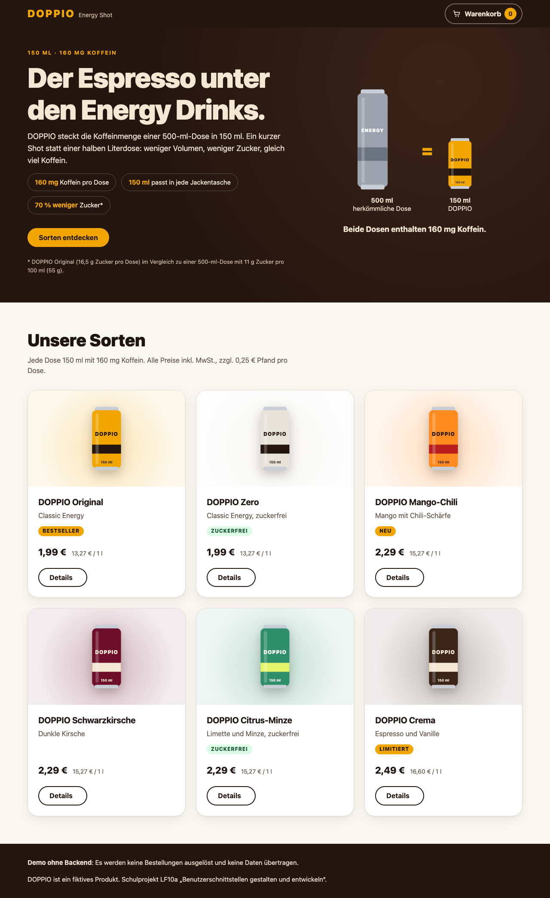
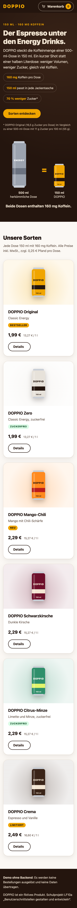
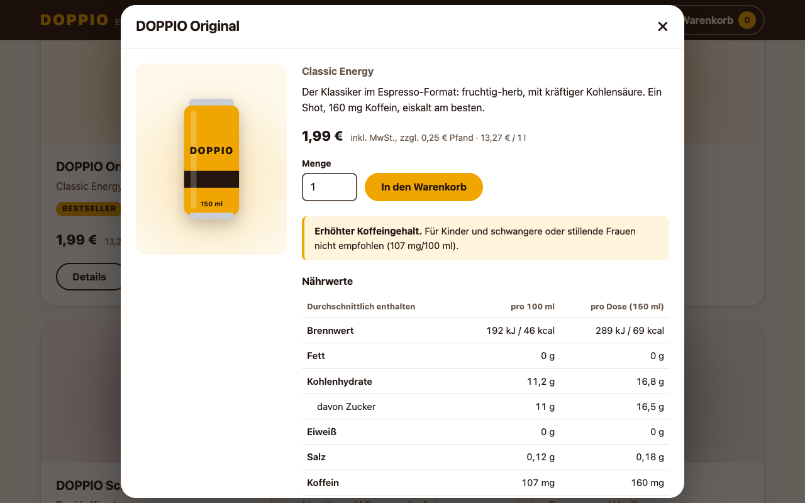
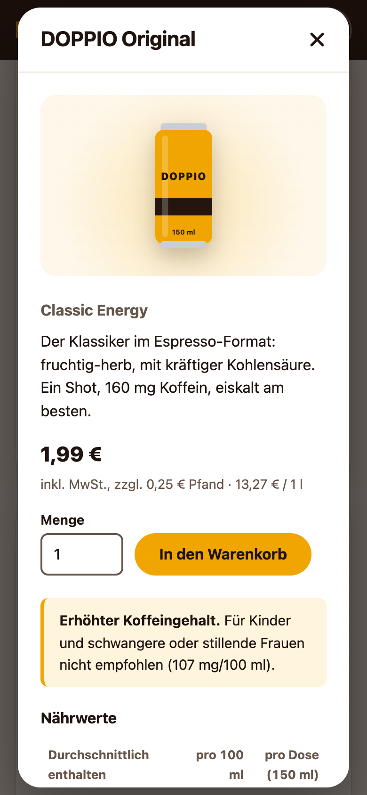
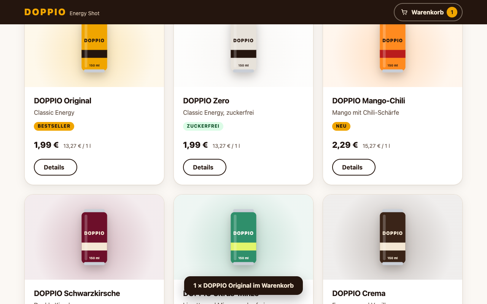
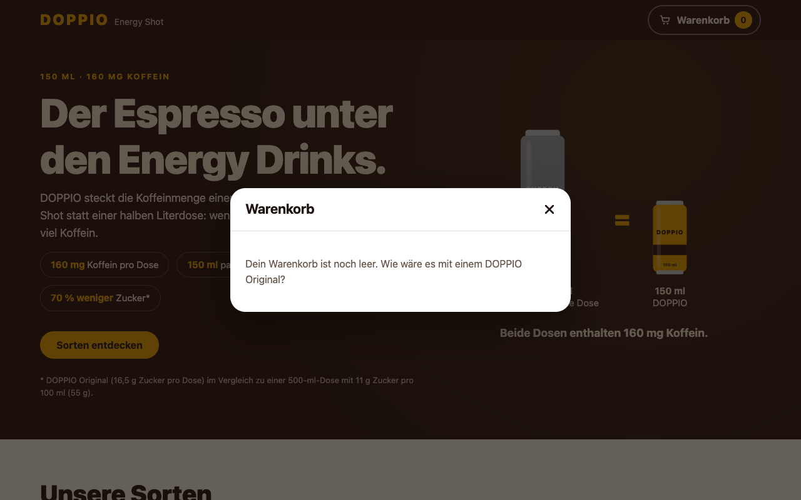
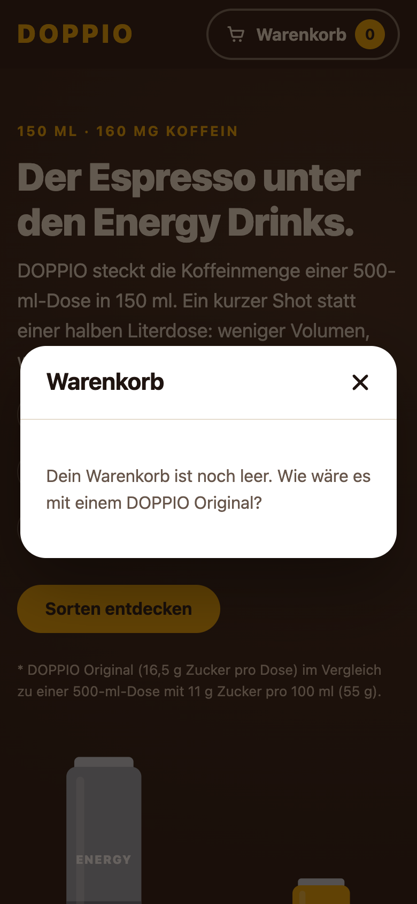
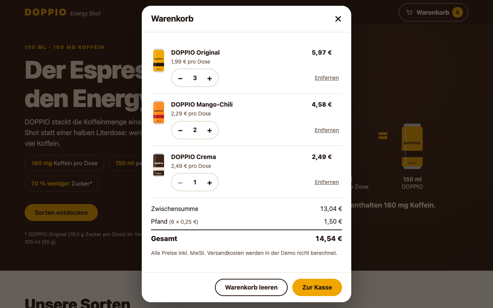
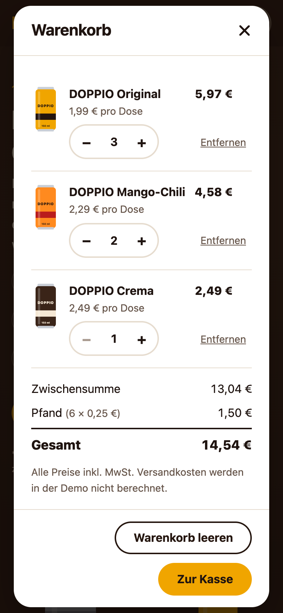

# Nachweise Issue #11

Erzeugt am 07.10.2026, 20:45 mit `npm run qa:evidence -- 11` (Commit 35784d3).

## Lighthouse 13 ([Mobil](lighthouse-mobil.html), [Desktop](lighthouse-desktop.html))

| Ansicht | Performance | Barrierefreiheit | Best Practices | SEO |
|---|---|---|---|---|
| Mobil | 100 | 100 | 100 | 100 |
| Desktop | 100 | 100 | 100 | 100 |

## axe-core 4.14.0 (WCAG 2.2 A/AA + Best Practices)

| Zustand | Ansicht | Verstöße | Bestanden | Manuell prüfen |
|---|---|---|---|---|
| Startzustand | desktop | 0 | 39 | 1 |
| Startzustand | mobil | 0 | 39 | 1 |
| Detailmodal geöffnet | desktop | 0 | 30 | 1 |
| Detailmodal geöffnet | mobil | 0 | 30 | 1 |
| Nach „In den Warenkorb“ | desktop | 0 | 39 | 1 |
| Nach „In den Warenkorb“ | mobil | 0 | 39 | 1 |
| Warenkorb leer | desktop | 0 | 22 | 0 |
| Warenkorb leer | mobil | 0 | 22 | 1 |
| Warenkorb gefüllt | desktop | 0 | 26 | 1 |
| Warenkorb gefüllt | mobil | 0 | 27 | 1 |

Keine Verstöße.

„Manuell prüfen“ sind Regeln, die axe nicht automatisch entscheiden kann (z. B. Kontrast auf Farbverläufen).
Details stehen in [axe.json](axe.json).

## Browserkonsole

Keine Fehler oder Warnungen.

## Screenshots

