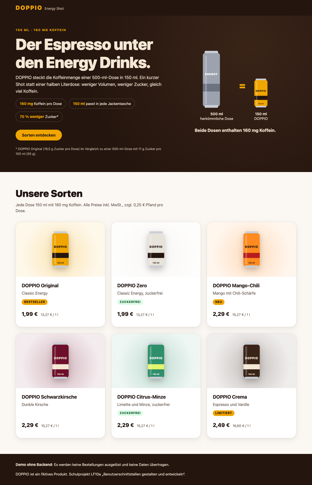
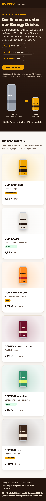

# Nachweise Issue #2

Erzeugt am 07.10.2026, 20:08 mit `npm run qa:evidence -- 2` (Commit d82369f).

## Lighthouse 13 ([Mobil](lighthouse-mobil.html), [Desktop](lighthouse-desktop.html))

| Ansicht | Performance | Barrierefreiheit | Best Practices | SEO |
|---|---|---|---|---|
| Mobil | 100 | 100 | 100 | 100 |
| Desktop | 100 | 100 | 100 | 100 |

## axe-core 4.14.0 (WCAG 2.2 A/AA + Best Practices)

| Zustand | Ansicht | Verstöße | Bestanden | Manuell prüfen |
|---|---|---|---|---|
| Startzustand | desktop | 0 | 33 | 1 |
| Startzustand | mobil | 0 | 33 | 1 |

Keine Verstöße.

„Manuell prüfen“ sind Regeln, die axe nicht automatisch entscheiden kann (z. B. Kontrast auf Farbverläufen).
Details stehen in [axe.json](axe.json).

## Browserkonsole

Keine Fehler oder Warnungen.

## Screenshots

