# Vorgehensdokumentation: Projekt 1 „Mini-Shop-UI“

**Fach:** LF10a, Benutzerschnittstellen gestalten und entwickeln (UW 5)\
**Thema:** Klickbare Kundendemo eines Mini-Shops ohne Backend, am Beispiel des fiktiven Energy Drinks **DOPPIO**\
**Werkzeuge:** GitHub Issues, Projects, Pull Requests; VS Code; Chrome DevTools; axe-core; Lighthouse

Im Mittelpunkt stand nicht der Shop, sondern der **Weg dorthin**. Das Projekt sollte Schritt für Schritt über GitHub-Issues entstehen: planen, umsetzen, prüfen, mergen, kommentieren, abschließen. Dieses Dokument zeigt, wie das abgelaufen ist, belegt mit Issues, Pull Requests, Commits und Screenshots.

## Auf einen Blick

| | |
|---|---|
| Issues | 9: fünf vorgegebene (#1–#5) und vier selbst ergänzte (#10–#13) |
| Pull Requests | 9 (#6–#9, #14–#18); jeder mit Selbst-Review nach Checkliste, zwei davon in zwei Runden |
| Commits auf `main` | 51 kleine Commits im Conventional-Commits-Format; bis auf die zwei Commits der Grundausstattung alle mit `Refs #n` |
| Automatische Tests | 63 (eine Testdatei pro Issue) |
| Qualität | Lighthouse 4 × 100 (mobil und Desktop), axe-core 0 Verstöße in fünf Zuständen |
| Gefundene Fehler | 13 Befunde aus Reviews, Nachweisen und Prüfungen: 12 behoben, 1 unter Beobachtung; dazu kleine Hinweise, die begründet belassen wurden |

| Issue | Pull Request | Ergebnis |
|---|---|---|
| [#1 Projektgrundlage erstellen](https://github.com/Laifstar/Mini-Shops-ohne-Backend/issues/1) | [#6](https://github.com/Laifstar/Mini-Shops-ohne-Backend/pull/6) | HTML-Gerüst, Stylesheet mit Design-Tokens, Produktdaten |
| [#2 Produktliste anzeigen](https://github.com/Laifstar/Mini-Shops-ohne-Backend/issues/2) | [#7](https://github.com/Laifstar/Mini-Shops-ohne-Backend/pull/7) | 6 Produktkarten aus dem JavaScript-Array |
| [#3 Detailmodal öffnen](https://github.com/Laifstar/Mini-Shops-ohne-Backend/issues/3) | [#8](https://github.com/Laifstar/Mini-Shops-ohne-Backend/pull/8) | natives `<dialog>` mit allen Produktdetails |
| [#4 Modal schließen und Oberfläche verbessern](https://github.com/Laifstar/Mini-Shops-ohne-Backend/issues/4) | [#9](https://github.com/Laifstar/Mini-Shops-ohne-Backend/pull/9) | ✕, Hintergrund, Esc, Fokus, Scroll-Sperre |
| [#10 Produkte in den Warenkorb legen](https://github.com/Laifstar/Mini-Shops-ohne-Backend/issues/10) | [#14](https://github.com/Laifstar/Mini-Shops-ohne-Backend/pull/14) | Mengenfeld, Bestätigung, Anzahl im Header |
| [#11 Warenkorb ansehen und bearbeiten](https://github.com/Laifstar/Mini-Shops-ohne-Backend/issues/11) | [#15](https://github.com/Laifstar/Mini-Shops-ohne-Backend/pull/15) | Warenkorb-Dialog mit Summen und Pfand |
| [#12 Barrierefreiheit prüfen](https://github.com/Laifstar/Mini-Shops-ohne-Backend/issues/12) | [#16](https://github.com/Laifstar/Mini-Shops-ohne-Backend/pull/16) | Prüfung „Fortgeschritten“, vier Barrieren behoben |
| [#5 Testen und Review durchführen](https://github.com/Laifstar/Mini-Shops-ohne-Backend/issues/5) | [#17](https://github.com/Laifstar/Mini-Shops-ohne-Backend/pull/17) | Abschluss-Testrunde, Review-Checkliste dokumentiert |
| [#13 Vorgehen dokumentieren](https://github.com/Laifstar/Mini-Shops-ohne-Backend/issues/13) | [#18](https://github.com/Laifstar/Mini-Shops-ohne-Backend/pull/18) | dieses Dokument, Prozess-Screenshots |

## Ausgangslage und Neustart

Zu Beginn gab es auf GitHub schon das Repository, das Board „DOPPIO: Mini-Shop ohne Backend“ und die fünf Issues #1–#5, aber noch keinen Code. Lokal lag ein früherer, bereits fertiger Stand des Shops. Er war in einem Rutsch entstanden und nach eigenen Tickets geschnitten, die nicht zu den GitHub-Issues passten.

**Entscheidung:** Neustart. Der alte Stand blieb lokal als Archiv (Branches `archiv/…`, nie gepusht) und diente nur noch als Vorlage. `main` begann leer und wuchs ausschließlich über die Issues. So zeigt die Historie auf GitHub den tatsächlichen Weg und nicht einen fertigen Block.

## Der Ablauf pro Issue

Jedes Issue lief durch denselben Zyklus:

1. Issue auf dem Board nach **In progress** ziehen.
2. Branch von `main` anlegen: `feature/<nr>-<kurzname>`.
3. In kleinen Commits umsetzen, jeder mit `Refs #<nr>`.
4. Für jedes Akzeptanzkriterium einen Browser-Test schreiben und eine **Gegenprobe** machen: Fehler absichtlich einbauen, Test muss rot werden.
5. **Nachweise** erzeugen (`npm run qa:evidence -- <nr>`) und committen.
6. Pushen, **Pull Request** mit `Closes #<nr>` öffnen, Issue auf **In review**.
7. **Selbst-Review** nach Checkliste. Bei einem Befund: Korrektur-Commit, Antwort am Zeilenkommentar, neue Review-Runde (zurück zu 3).
8. **Mergen** per Merge-Commit, Branch löschen. GitHub schließt das Issue, das Board springt auf **Done**.
9. Im Issue die Akzeptanzkriterien **abhaken** und einen **Abschlusskommentar** schreiben: Ergebnis, Nachweise, was als Nächstes kommt.
10. Screenshots von Board, Pull Request und Issue für diese Dokumentation.

**Konventionen:**

- **Branches:** `feature/<nr>-<kurzname>`, immer von aktuellem `main`.
- **Commits:** auf Englisch nach Conventional Commits (`feat:`, `fix:`, `test:`, `docs:`, …), jeweils eine Sache. Im Text steht das *Warum*, am Ende `Refs #nr`.
- **Pull Requests:** auf Englisch, mit `Closes #nr`. GitHub schließt das Issue beim Merge selbst.
- **Merge:** per Merge-Commit, kein Squash. Die einzelnen Schritte bleiben in der Historie sichtbar.
- **Sprache:** Issues, Kommentare und Dokumentation auf Deutsch; Code-Kommentare, Commits und Pull Requests auf Englisch.

## 1.1 Planung: Welche Schritte sind für ein Backlog notwendig?

So sind wir vorgegangen. Diese Schritte waren nötig:

1. **Ziel und Rahmen klären:** Kundendemo ohne Backend; die Seite muss sich per Doppelklick öffnen lassen (`file://`); Qualitätsziel Lighthouse ≥ 90.
2. **Tickets als User Stories mit prüfbaren Akzeptanzkriterien:** Die fünf Issues #1–#5 waren vorgegeben. Jedes Kriterium ist mit „erfüllt / nicht erfüllt“ beantwortbar und wurde später zu einem Test.
3. **Ordnen:** Labels (`setup`, `feature`, `ui`, `accessibility`, `qa`, `documentation`), ein Milestone „UW5: Mini-Shop-UI“, auf dem Board Priorität (P0–P2) und Größe (S/M) pro Issue.
4. **Board mit Status-Spalten:** Todo → In progress → **In review** → Done. Die Spalte „In review“ haben wir ergänzt, damit die Prüfphase sichtbar wird.
5. **Während des Projekts verfeinern:** Nach #4 kamen vier Issues dazu (#10–#13). Der Warenkorb war als *ein* Ticket zu groß (Größe L). Nach der Definition of Ready heißt das „aufteilen“, daraus wurden #10 und #11. In #5 wurden Notizen für die Testrunde gesammelt ([Planungskommentar](https://github.com/Laifstar/Mini-Shops-ohne-Backend/issues/5#issuecomment-6044310749)).

| Ausgangslage | Geplant (Labels, Milestone, Priorität, Größe) | Nach der Verfeinerung |
|---|---|---|
| 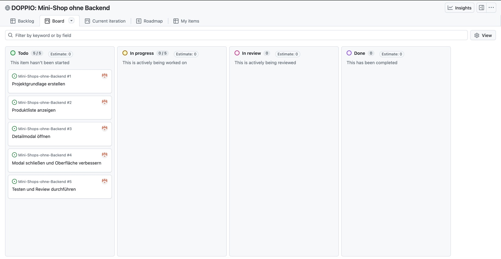 | 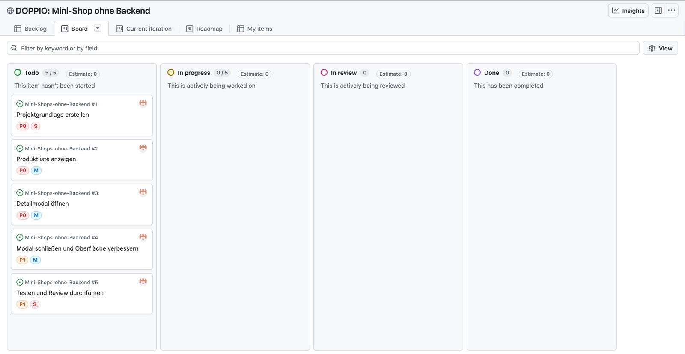 | 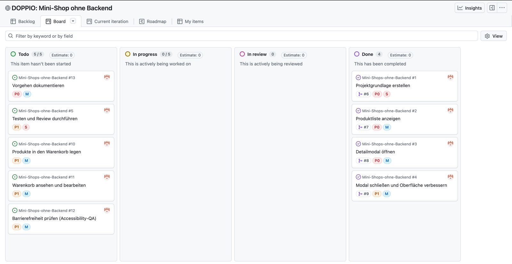 |

## 1.2 Umsetzung: nachvollziehbar und kommentiert

**Nachvollziehbar durch kleine Schritte.** Jedes Issue bestand aus mehreren Commits mit je einer Aufgabe, z. B. für #4:

```text
test: adapt detail modal tests to the close button
feat: close the detail modal by button and backdrop click
feat: lock page scrolling while the modal is open
feat: fade the modal in unless reduced motion is preferred
test: add browser tests for closing and layout
docs: add closing the modal to README features
docs: add QA evidence for closing the modal
```

In #4 haben wir die Reihenfolge so gewählt, dass nach **jedem** Commit alle Tests grün sind. Geprüft wurde das mit `git rebase --exec "npm test"`.

**Kommentiert:** Kommentare erklären das *Warum*, nicht das *Was*, zum Beispiel:
- warum klassische Skripte statt ES-Modulen (`file://`),
- warum Preise in Cent gespeichert werden,
- warum `aria-disabled` statt `disabled`.

**Geprüft bei jedem Schritt:**

- **Tests pro Issue:** Jedes Akzeptanzkriterium bekam einen Browser-Test in `tests/issue-<nr>-….test.mjs`.
- **Gegenprobe:** Für jedes Issue wurde der zentrale Fehler einmal absichtlich eingebaut. Der passende Test musste dann rot werden. Zweimal wurde er es nicht (#2, #10), dann war der Test falsch und wurde korrigiert.
- **Nachweise:** Nach jedem Issue erzeugte `npm run qa:evidence -- <nr>` Screenshots (Desktop und mobil), ein axe-core-Ergebnis in allen Zuständen und Lighthouse-Reports in [`docs/screenshots/issue-<nr>/`](screenshots/).

**So ist der Shop gewachsen:**

| #1 Grundgerüst | #2 Produktliste | #3 Detailmodal | #4 Schließen | #10 In den Warenkorb | #11 Warenkorb |
|---|---|---|---|---|---|
| 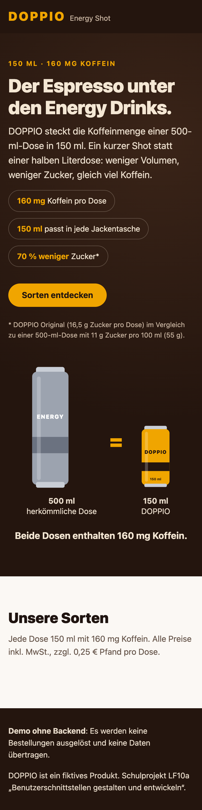 |  | 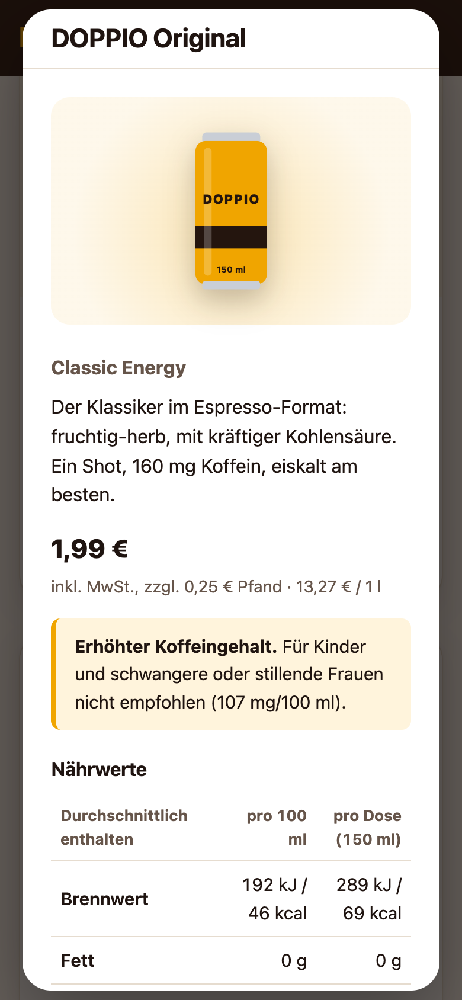 |  | 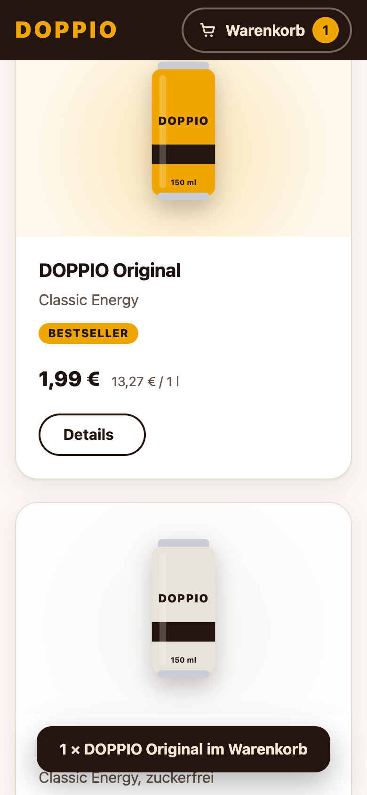 |  |

## 1.3 Überprüfung: Woran erkennst du, dass die Aufgabe gelöst ist?

Eine Aufgabe galt als gelöst, wenn es **Nachweise statt eines Gefühls** gab:

1. **Jedes Akzeptanzkriterium ist belegt.** Es gibt einen automatischen Test dafür oder, wo das nicht geht, eine dokumentierte Prüfung. Im Issue ist das Kriterium abgehakt.
2. **Der Test kann scheitern.** Durch die Gegenprobe ist bewiesen, dass er den Fehler überhaupt bemerkt.
3. **Die Messwerte stimmen:** Lighthouse ≥ 90 (erreicht: 100), axe-core 0 Verstöße in **allen** Zuständen, nicht nur beim Laden. Lighthouse sieht weder das geöffnete Modal noch den Warenkorb.
4. **Die Checkliste ist abgearbeitet**, und das Review hat keine offenen Befunde.
5. **Der Merge schließt das Issue**, und das Board steht auf „Done“.

**Wichtigste Erkenntnis:** Automatische Werkzeuge melden „nichts gefunden“, nicht „alles gut“. Die Barrierefreiheits-Prüfung in #12 fand vier echte Barrieren, obwohl axe-core vorher 0 Verstöße und Lighthouse 100 meldete. Details: [Prüfprotokoll Barrierefreiheit](barrierefreiheit.md) und [Testprotokoll der Abschlussrunde](testprotokoll.md).

## 1.4 Review-Checkliste erstellen und anwenden

Die Checkliste liegt als **PR-Vorlage** in [`.github/pull_request_template.md`](../.github/pull_request_template.md). GitHub fügt sie in jeden Pull Request ein. Sie hat sechs Bereiche: Umfang, Code-Qualität, Layout, Barrierefreiheit, Lighthouse, Prozess. Wie jeder Punkt geprüft wird, steht in der [Review-Checkliste mit Prüfwegen](review-checkliste.md).

**Angewendet** wurde sie auf jeden der neun Pull Requests:
- Vor dem Review hakte die Autorin bzw. der Autor ab.
- Im Review wurde jeder Punkt selbst nachgeprüft, mit einer Tabelle „Bereich – Ergebnis – wie geprüft“.
- Konkrete Befunde stehen als **Zeilenkommentare** direkt am Code.

Weil nur ein GitHub-Konto beteiligt war, lief das Review als **Selbst-Review in der Rolle der Partnerin bzw. des Partners**. GitHub erlaubt beim eigenen PR weder „Approve“ noch „Request changes“, daher steht die Entscheidung im Kommentar.

**Zwei Reviews mit zwei Runden:**

- **[#8](https://github.com/Laifstar/Mini-Shops-ohne-Backend/pull/8):** Runde 1 fand toten Code, Entscheidung „Changes needed“. Nach Korrektur und Antwort am Zeilenkommentar kam Runde 2 ohne Befund.
- **[#17](https://github.com/Laifstar/Mini-Shops-ohne-Backend/pull/17):** Runde 1 fand einen Zahlen-Widerspruch im eigenen Testprotokoll, der ebenfalls behoben wurde.

| Review Runde 1 mit Befund (#8) | Selbst-Review mit Checkliste (#16) | Abgeschlossenes Issue mit Kommentar (#3) |
|---|---|---|
| 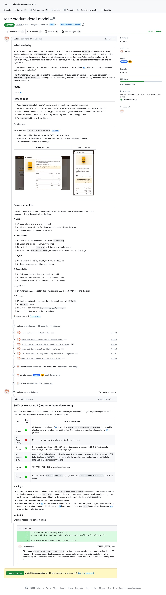 | 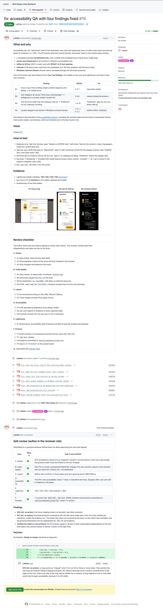 | 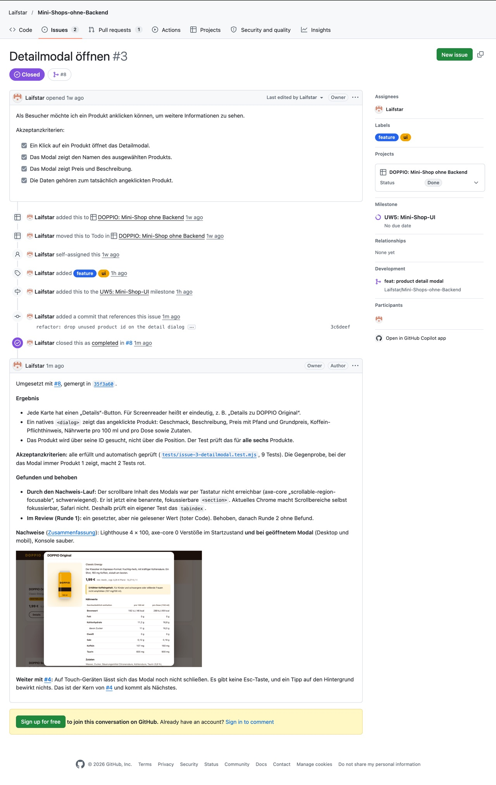 |

## Die Entwicklung des Boards

<table>
<tr>
<td><br>Ausgangslage</td>
<td><br>geplant</td>
<td>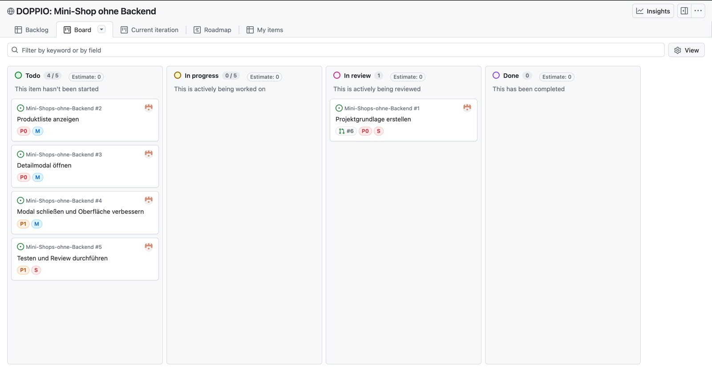<br>#1 in Review</td>
</tr>
<tr>
<td>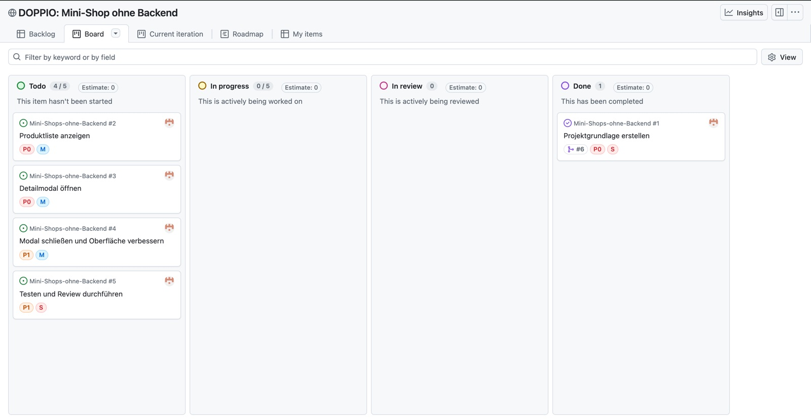<br>#1 fertig</td>
<td>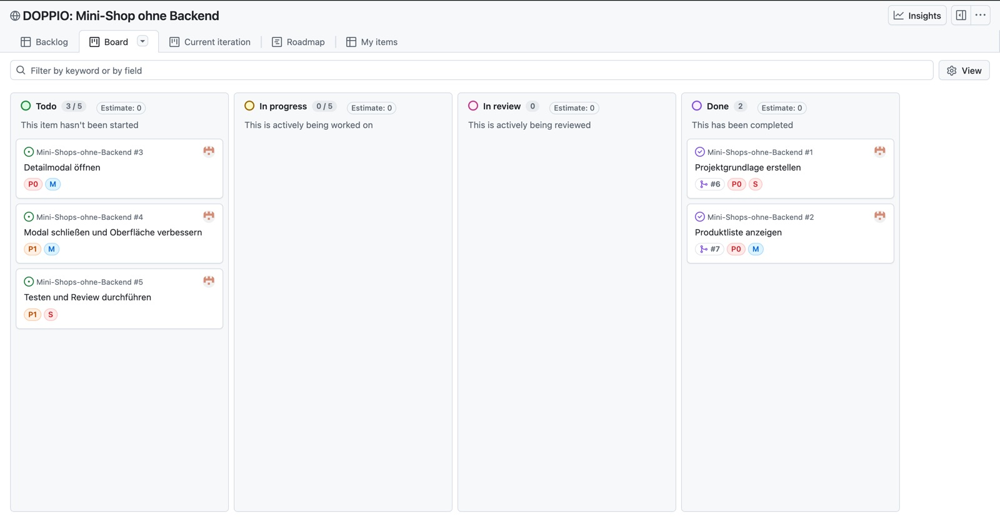<br>#2 fertig</td>
<td>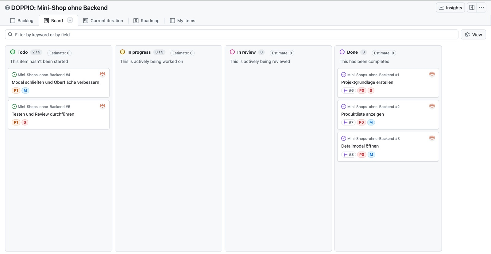<br>#3 fertig</td>
</tr>
<tr>
<td>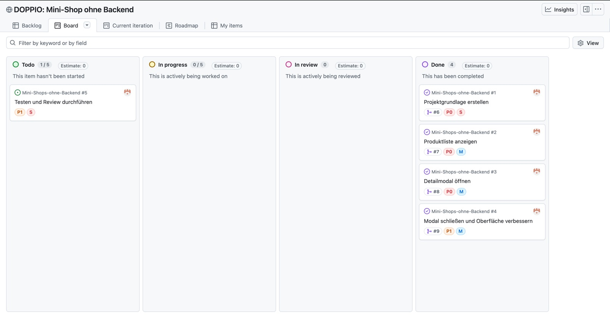<br>#4 fertig: Basis erledigt</td>
<td><br>Backlog verfeinert (#10–#13)</td>
<td>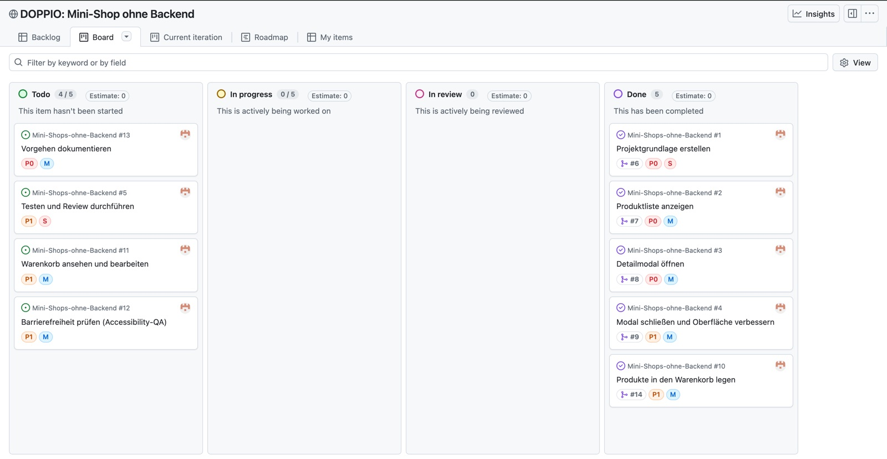<br>#10 fertig</td>
</tr>
<tr>
<td>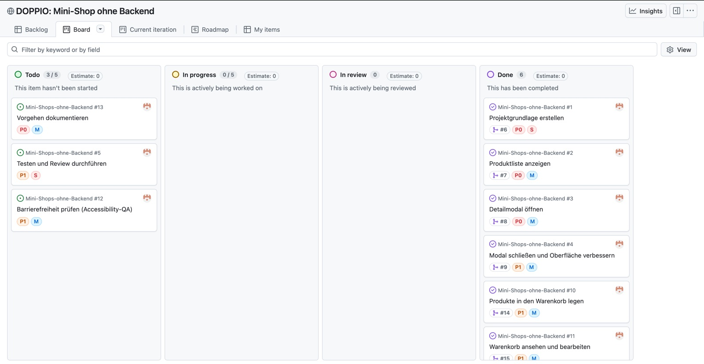<br>#11 fertig</td>
<td>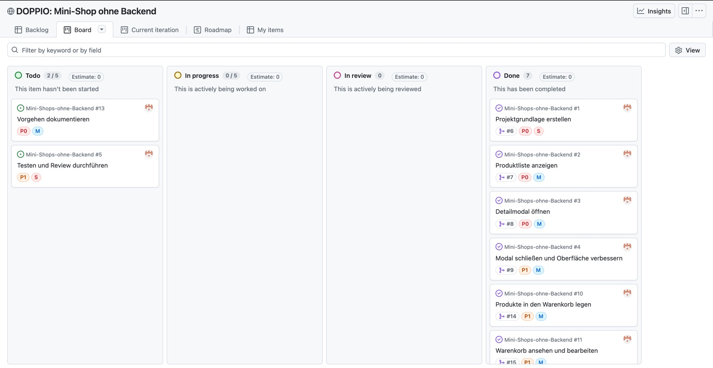<br>#12 fertig</td>
<td>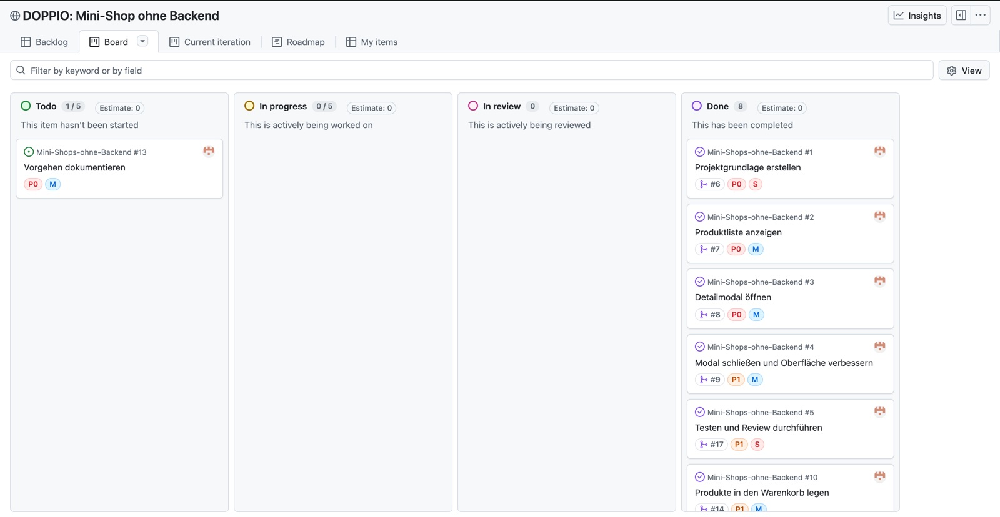<br>#5 fertig, nur #13 offen</td>
</tr>
</table>

Die 57 Prozess-Screenshots bis zum Beginn dieses Issues, chronologisch nummeriert: [`docs/screenshots/prozess/`](screenshots/prozess/). Das [Board](https://github.com/users/Laifstar/projects/2/views/2) zeigt den aktuellen Stand.

## Learnings

**Zum Arbeiten mit Issues und Pull Requests**

- **Gute Akzeptanzkriterien sind schon die halbe Prüfung.** Jedes Kriterium wurde direkt zu einem Test.
- **Ein Backlog lebt.** Neue Issues, ein aufgeteiltes Ticket und gesammelte Notizen in #5 sind kein Planungsfehler, sondern Planung.
- **Kleine Commits mit `Refs #n` machen die Historie lesbar.** Jeder Schritt ist im Issue verlinkt.
- **Automatik prüfen statt ihr zu glauben.** Die Board-Regel „Pull request linked to issue“ setzt ein Issue beim Öffnen des PR zurück auf „In progress“. Der Status musste danach jedes Mal neu auf „In review“ gesetzt werden.
- **Die Git-Identität vor dem ersten Push prüfen.** Die ersten Commits liefen unter einem anderen GitHub-Konto. Das ließ sich vor dem ersten Merge mit einem einmaligen Force-Push korrigieren; danach wäre es viel aufwendiger gewesen.

**Zum Prüfen**

- **Ein Test ist erst glaubwürdig, wenn man ihn einmal hat scheitern sehen.** Zweimal hat erst die Gegenprobe gezeigt, dass ein Test den Fehler gar nicht bemerkt.
- **Hinsehen gehört dazu.** Den Umbruch im Header bei 390 px (#10) fand kein Test, sondern der Blick auf den Screenshot.
- **Reviews übersehen auch etwas.** Eine ungenutzte CSS-Regel kam in #8 durchs Review und fiel erst in #10 auf. Seit #5 findet ein Test so etwas automatisch.
- **Tests können selbst unzuverlässig sein.** Zeitliche Rennen und Messungen während Animationen (#4) erzeugen Fehler, die es im Shop gar nicht gibt.
- **0 Verstöße heißt nicht barrierefrei** (siehe 1.3).

## Offene Punkte

- **Manuelle Prüfungen auf echten Geräten** (iPhone/Safari, Firefox, Safari auf dem Mac, VoiceOver, Windows-Kontrastmodus): Die Prüfliste steht in [Abschnitt 5 des Testprotokolls](testprotokoll.md#5-manuelle-prüfungen-für-das-team). Diese Prüfungen ließen sich von hier aus nicht automatisieren.
- **Ein einmal beobachteter Test-Timeout** (#15) war nicht reproduzierbar. Status: beobachten.
- **Icebox:** bewusst zurückgestellte Ideen, siehe [Review-Checkliste, Abschnitt 3](review-checkliste.md#3-icebox).
- **UW 6 (Hi-Fi-Prototyp)** ist eine eigene Aufgabe und gehört nicht zu diesem Milestone. Der frühere Stand liegt lokal im Archiv-Branch `archiv/hifi-prototyp`.
